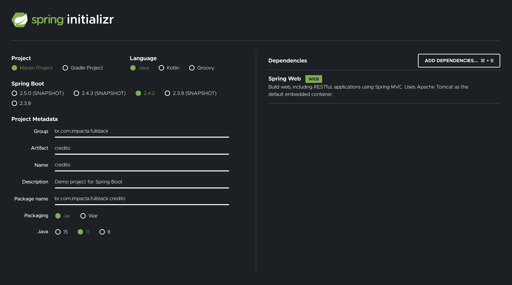
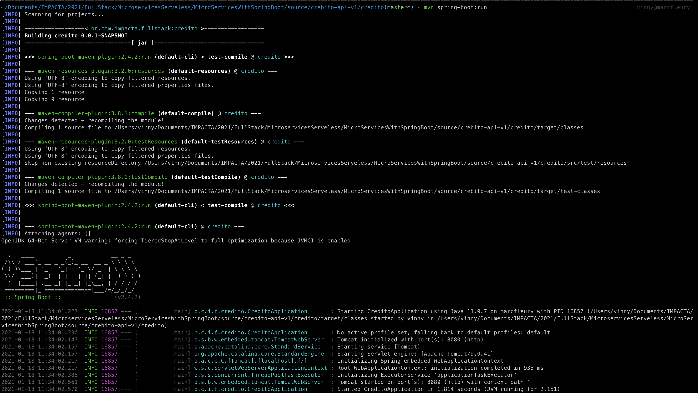
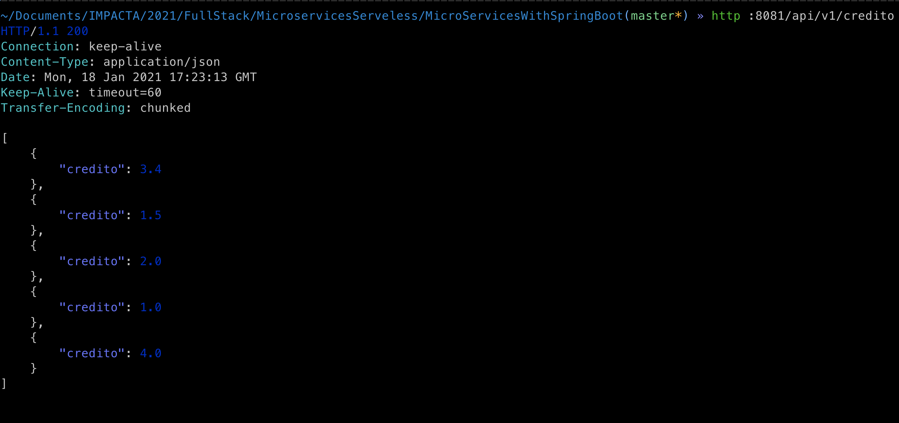
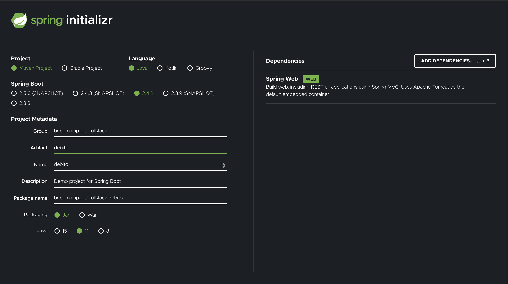
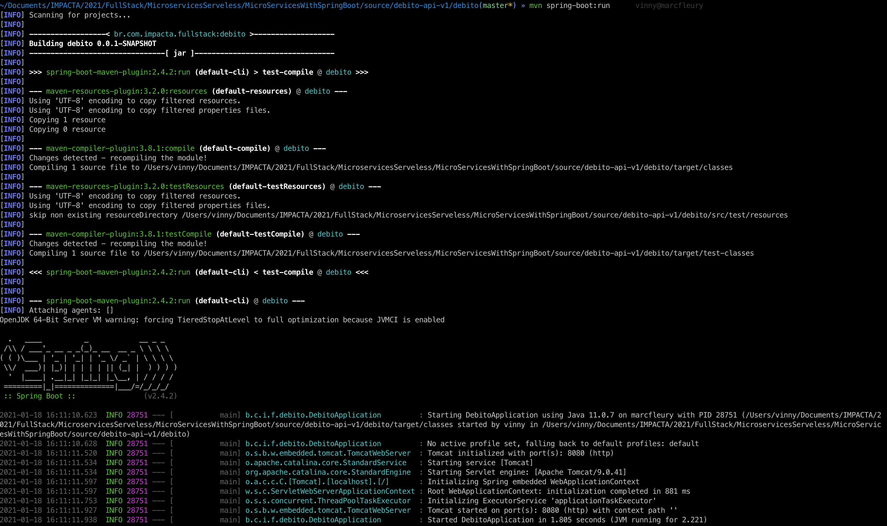

# Microservices com Spring Boot

Neste repositório estarão disponíveis nosso *Workshop* de implementação de **Microservices** com [Spring Boot](https://spring.io/projects/spring-boot)

## Pré Requisitos

- [JDK/Open JDK 11 (no mínimo)](https://openjdk.java.net/install/)
- [Apache Maven 3.6.x](https://maven.apache.org/download.cgi)
- [IntelliJ Community](https://www.jetbrains.com/idea/download/#section=mac)
- [Docker Desktop Win/Mac 3.x](https://www.docker.com/products/docker-desktop)
- [Docker Desktop Win/Mac 3.x](https://www.docker.com/products/docker-desktop)

## Workshop

0. [Criação Credito API](#workshop-criacao-credito-api)
1. [Criação Debito API](#workshop-criacao-debito-api)
2. [Criação SaldoExtrato API](#workshop-criacao-saldoextrato-api)
3. [Criação SaldoExtrato BFF API](#workshop-criacao-saldoextrato-bff-api)

## Implementação

### 0 - Criação Credito API <a name="workshop-criacao-credito-api">

* Acesse o [Spring Boot Initializer](https://start.spring.io/) e gere um projeto com as seguintes informações:

  ```
  Project: Maven
  Language: Java
  Spring Boot: 2.4.2
  Project Metadata
    Group: br.com.impacta.fullstack
    artifact: credito
    name: credito
    Package Name: br.com.impacta.fullstack.credito
    Packaging: jar
    Java: 11
  Dependencies:
    Spring Web
  ```

  

* Importe o projeto no *IntelliJ* e verifique se o mesmo está sendo executado com sucesso através do comando *mvn spring:boot run*:

  ```
  ~/Documents/IMPACTA/2021/FullStack/MicroservicesServeless/MicroServicesWithSpringBoot/source/crebito-api-v1/credito(master*) » mvn spring-boot:run
  [INFO] Scanning for projects...
  [INFO]
  [INFO] ------------------< br.com.impacta.fullstack:credito >------------------
  [INFO] Building credito 0.0.1-SNAPSHOT
  [INFO] --------------------------------[ jar ]---------------------------------
  [INFO]
  [INFO] >>> spring-boot-maven-plugin:2.4.2:run (default-cli) > test-compile @ credito >>>
  [INFO]
  [INFO] --- maven-resources-plugin:3.2.0:resources (default-resources) @ credito ---
  [INFO] Using 'UTF-8' encoding to copy filtered resources.
  [INFO] Using 'UTF-8' encoding to copy filtered properties files.
  [INFO] Copying 1 resource
  [INFO] Copying 0 resource
  [INFO]
  [INFO] --- maven-compiler-plugin:3.8.1:compile (default-compile) @ credito ---
  [INFO] Changes detected - recompiling the module!
  [INFO] Compiling 1 source file to /Users/vinny/Documents/IMPACTA/2021/FullStack/MicroservicesServeless/MicroServicesWithSpringBoot/source/crebito-api-v1/credito/target/classes
  [INFO]
  [INFO] --- maven-resources-plugin:3.2.0:testResources (default-testResources) @ credito ---
  [INFO] Using 'UTF-8' encoding to copy filtered resources.
  [INFO] Using 'UTF-8' encoding to copy filtered properties files.
  [INFO] skip non existing resourceDirectory /Users/vinny/Documents/IMPACTA/2021/FullStack/MicroservicesServeless/MicroServicesWithSpringBoot/source/crebito-api-v1/credito/src/test/resources
  [INFO]
  [INFO] --- maven-compiler-plugin:3.8.1:testCompile (default-testCompile) @ credito ---
  [INFO] Changes detected - recompiling the module!
  [INFO] Compiling 1 source file to /Users/vinny/Documents/IMPACTA/2021/FullStack/MicroservicesServeless/MicroServicesWithSpringBoot/source/crebito-api-v1/credito/target/test-classes
  [INFO]
  [INFO] <<< spring-boot-maven-plugin:2.4.2:run (default-cli) < test-compile @ credito <<<
  [INFO]
  [INFO]
  [INFO] --- spring-boot-maven-plugin:2.4.2:run (default-cli) @ credito ---
  [INFO] Attaching agents: []
  OpenJDK 64-Bit Server VM warning: forcing TieredStopAtLevel to full optimization because JVMCI is enabled

    .   ____          _            __ _ _
   /\\ / ___'_ __ _ _(_)_ __  __ _ \ \ \ \
  ( ( )\___ | '_ | '_| | '_ \/ _` | \ \ \ \
   \\/  ___)| |_)| | | | | || (_| |  ) ) ) )
    '  |____| .__|_| |_|_| |_\__, | / / / /
   =========|_|==============|___/=/_/_/_/
   :: Spring Boot ::                (v2.4.2)

  2021-01-18 11:34:01.227  INFO 16857 --- [           main] b.c.i.f.credito.CreditoApplication       : Starting CreditoApplication using Java 11.0.7 on marcfleury with PID 16857 (/Users/vinny/Documents/IMPACTA/2021/FullStack/MicroservicesServeless/MicroServicesWithSpringBoot/source/crebito-api-v1/credito/target/classes started by vinny in /Users/vinny/Documents/IMPACTA/2021/FullStack/MicroservicesServeless/MicroServicesWithSpringBoot/source/crebito-api-v1/credito)
  2021-01-18 11:34:01.230  INFO 16857 --- [           main] b.c.i.f.credito.CreditoApplication       : No active profile set, falling back to default profiles: default
  2021-01-18 11:34:02.147  INFO 16857 --- [           main] o.s.b.w.embedded.tomcat.TomcatWebServer  : Tomcat initialized with port(s): 8080 (http)
  2021-01-18 11:34:02.157  INFO 16857 --- [           main] o.apache.catalina.core.StandardService   : Starting service [Tomcat]
  2021-01-18 11:34:02.157  INFO 16857 --- [           main] org.apache.catalina.core.StandardEngine  : Starting Servlet engine: [Apache Tomcat/9.0.41]
  2021-01-18 11:34:02.217  INFO 16857 --- [           main] o.a.c.c.C.[Tomcat].[localhost].[/]       : Initializing Spring embedded WebApplicationContext
  2021-01-18 11:34:02.217  INFO 16857 --- [           main] w.s.c.ServletWebServerApplicationContext : Root WebApplicationContext: initialization completed in 935 ms
  2021-01-18 11:34:02.385  INFO 16857 --- [           main] o.s.s.concurrent.ThreadPoolTaskExecutor  : Initializing ExecutorService 'applicationTaskExecutor'
  2021-01-18 11:34:02.561  INFO 16857 --- [           main] o.s.b.w.embedded.tomcat.TomcatWebServer  : Tomcat started on port(s): 8080 (http) with context path ''
  2021-01-18 11:34:02.570  INFO 16857 --- [           main] b.c.i.f.credito.CreditoApplication       : Started CreditoApplication in 1.814 seconds (JVM running for 2.151)
  ```
    * o *output* deve variar variar ligeiramente do apresentando anteriormente observando as características do seu ambiente

  

* Criar da classe **br.com.impacta.fullstack.credito.Credito**

  ```
  package br.com.impacta.fullstack.credito;

  import java.io.Serializable;
  import java.math.BigDecimal;

  public class Credito implements Serializable {

      private BigDecimal credito;

      public Credito() {
          super();
      }

      public Credito(BigDecimal credito){
          this.credito = credito;
      }

      public BigDecimal getCredito() {
          return credito;
      }

      public void setCredito(BigDecimal credito) {
          this.credito = credito;
      }

      @Override
      public int hashCode() {
          return super.hashCode();
      }

      @Override
      public boolean equals(Object obj) {
          return super.equals(obj);
      }

      @Override
      protected Object clone() throws CloneNotSupportedException {
          return super.clone();
      }

      @Override
      public String toString() {
          return super.toString();
      }

  }
  ```

* Criar da classe **br.com.impacta.fullstack.credito.CreditoService**

  ```
  package br.com.impacta.fullstack.credito;

  import org.springframework.stereotype.Component;

  import java.math.BigDecimal;
  import java.math.BigInteger;
  import java.util.ArrayList;
  import java.util.List;
  import java.util.Random;

  @Component
  public class CreditoService {

    private static final BigDecimal minValue = new BigDecimal(BigInteger.ONE);
    private static final BigDecimal maxValue = new BigDecimal(BigInteger.TEN);

    public List<Credito> list(){
        int numberOfCredit = new Random().nextInt(10) + 1;
        List<Credito> creditoList = new ArrayList<Credito>(10);
        for (int i = 0; i < numberOfCredit; i++) {
            BigDecimal randomValue = minValue.add(new BigDecimal(Math.random()).multiply(maxValue.subtract(minValue))).setScale(1, BigDecimal.ROUND_HALF_UP);
            Credito credito = new Credito(randomValue);
            creditoList.add(credito);
        }
        return creditoList;
    }
  }
  ```

* Criar da classe **br.com.impacta.fullstack.credito.CreditoController**

  ```
  package br.com.impacta.fullstack.credito;

  import org.springframework.web.bind.annotation.GetMapping;
  import org.springframework.web.bind.annotation.RequestMapping;
  import org.springframework.web.bind.annotation.RestController;

  import java.util.List;

  @RestController
  @RequestMapping("/api/v1/credito")
  public class CreditoController {

      private final CreditoService creditoService;

      public CreditoController(CreditoService creditoService) {
          this.creditoService = creditoService;
      }

      @GetMapping
      public List<Credito> list(){
          return creditoService.list();
      }

  }
  ```

* Ajustes na configuração de porta para evitar conflitos no arquivo **src/main/resources/application.properties**:

  ```
  server.port = 8081
  ```

* Para testar basta inicializar o serviço e invocar a *API* através de seu endpoint:

  ```
  mvn spring:boot run

  -- outra aba do terminal/postman/httpie/curl/etc
  http :8081/api/v1/credito
  ```

  

### 1 - Criação Débito API <a name="workshop-criacao-debito-api">

  * Acesse o [Spring Boot Initializer](https://start.spring.io/) e gere um projeto com as seguintes informações:

    ```
    Project: Maven
    Language: Java
    Spring Boot: 2.4.2
    Project Metadata
      Group: br.com.impacta.fullstack
      artifact: debito
      name: debito
      Package Name: br.com.impacta.fullstack.debito
      Packaging: jar
      Java: 11
    Dependencies:
      Spring Web
    ```

    

  * Importe o projeto no *IntelliJ* e verifique se o mesmo está sendo executado com sucesso através do comando *mvn spring:boot run*:

    ```
    ~/Documents/IMPACTA/2021/FullStack/MicroservicesServeless/MicroServicesWithSpringBoot/source/debito-api-v1/debito(master*) » mvn spring-boot:run      vinny@marcfleury
    [INFO] Scanning for projects...
    [INFO]
    [INFO] ------------------< br.com.impacta.fullstack:debito >-------------------
    [INFO] Building debito 0.0.1-SNAPSHOT
    [INFO] --------------------------------[ jar ]---------------------------------
    [INFO]
    [INFO] >>> spring-boot-maven-plugin:2.4.2:run (default-cli) > test-compile @ debito >>>
    [INFO]
    [INFO] --- maven-resources-plugin:3.2.0:resources (default-resources) @ debito ---
    [INFO] Using 'UTF-8' encoding to copy filtered resources.
    [INFO] Using 'UTF-8' encoding to copy filtered properties files.
    [INFO] Copying 1 resource
    [INFO] Copying 0 resource
    [INFO]
    [INFO] --- maven-compiler-plugin:3.8.1:compile (default-compile) @ debito ---
    [INFO] Changes detected - recompiling the module!
    [INFO] Compiling 1 source file to /Users/vinny/Documents/IMPACTA/2021/FullStack/MicroservicesServeless/MicroServicesWithSpringBoot/source/debito-api-v1/debito/target/classes
    [INFO]
    [INFO] --- maven-resources-plugin:3.2.0:testResources (default-testResources) @ debito ---
    [INFO] Using 'UTF-8' encoding to copy filtered resources.
    [INFO] Using 'UTF-8' encoding to copy filtered properties files.
    [INFO] skip non existing resourceDirectory /Users/vinny/Documents/IMPACTA/2021/FullStack/MicroservicesServeless/MicroServicesWithSpringBoot/source/debito-api-v1/debito/src/test/resources
    [INFO]
    [INFO] --- maven-compiler-plugin:3.8.1:testCompile (default-testCompile) @ debito ---
    [INFO] Changes detected - recompiling the module!
    [INFO] Compiling 1 source file to /Users/vinny/Documents/IMPACTA/2021/FullStack/MicroservicesServeless/MicroServicesWithSpringBoot/source/debito-api-v1/debito/target/test-classes
    [INFO]
    [INFO] <<< spring-boot-maven-plugin:2.4.2:run (default-cli) < test-compile @ debito <<<
    [INFO]
    [INFO]
    [INFO] --- spring-boot-maven-plugin:2.4.2:run (default-cli) @ debito ---
    [INFO] Attaching agents: []
    OpenJDK 64-Bit Server VM warning: forcing TieredStopAtLevel to full optimization because JVMCI is enabled

      .   ____          _            __ _ _
     /\\ / ___'_ __ _ _(_)_ __  __ _ \ \ \ \
    ( ( )\___ | '_ | '_| | '_ \/ _` | \ \ \ \
     \\/  ___)| |_)| | | | | || (_| |  ) ) ) )
      '  |____| .__|_| |_|_| |_\__, | / / / /
     =========|_|==============|___/=/_/_/_/
     :: Spring Boot ::                (v2.4.2)

    2021-01-18 16:11:10.623  INFO 28751 --- [           main] b.c.i.f.debito.DebitoApplication         : Starting DebitoApplication using Java 11.0.7 on marcfleury with PID 28751 (/Users/vinny/Documents/IMPACTA/2021/FullStack/MicroservicesServeless/MicroServicesWithSpringBoot/source/debito-api-v1/debito/target/classes started by vinny in /Users/vinny/Documents/IMPACTA/2021/FullStack/MicroservicesServeless/MicroServicesWithSpringBoot/source/debito-api-v1/debito)
    2021-01-18 16:11:10.628  INFO 28751 --- [           main] b.c.i.f.debito.DebitoApplication         : No active profile set, falling back to default profiles: default
    2021-01-18 16:11:11.520  INFO 28751 --- [           main] o.s.b.w.embedded.tomcat.TomcatWebServer  : Tomcat initialized with port(s): 8080 (http)
    2021-01-18 16:11:11.534  INFO 28751 --- [           main] o.apache.catalina.core.StandardService   : Starting service [Tomcat]
    2021-01-18 16:11:11.534  INFO 28751 --- [           main] org.apache.catalina.core.StandardEngine  : Starting Servlet engine: [Apache Tomcat/9.0.41]
    2021-01-18 16:11:11.597  INFO 28751 --- [           main] o.a.c.c.C.[Tomcat].[localhost].[/]       : Initializing Spring embedded WebApplicationContext
    2021-01-18 16:11:11.597  INFO 28751 --- [           main] w.s.c.ServletWebServerApplicationContext : Root WebApplicationContext: initialization completed in 881 ms
    2021-01-18 16:11:11.753  INFO 28751 --- [           main] o.s.s.concurrent.ThreadPoolTaskExecutor  : Initializing ExecutorService 'applicationTaskExecutor'
    2021-01-18 16:11:11.927  INFO 28751 --- [           main] o.s.b.w.embedded.tomcat.TomcatWebServer  : Tomcat started on port(s): 8080 (http) with context path ''
    2021-01-18 16:11:11.938  INFO 28751 --- [           main] b.c.i.f.debito.DebitoApplication         : Started DebitoApplication in 1.805 seconds (JVM running for 2.221)
    ```
      * o *output* deve variar variar ligeiramente do apresentando anteriormente observando as características do seu ambiente

    

  * Criar da classe **br.com.impacta.fullstack.credito.Debito**

    ```
    package br.com.impacta.fullstack.debito;

    import java.io.Serializable;
    import java.math.BigDecimal;

    public class Debito implements Serializable {

        private BigDecimal debito;

        public Debito(BigDecimal debito) {
            super();
            this.debito = debito;
        }

        @Override
        public int hashCode() {
            return super.hashCode();
        }

        @Override
        public boolean equals(Object obj) {
            return super.equals(obj);
        }

        @Override
        protected Object clone() throws CloneNotSupportedException {
            return super.clone();
        }

        @Override
        public String toString() {
            return super.toString();
        }

        @Override
        protected void finalize() throws Throwable {
            super.finalize();
        }

        public BigDecimal getDebito() {
            return debito;
        }

        public void setDebito(BigDecimal debito) {
            this.debito = debito;
        }
    }

    ```

  * Criar da classe **br.com.impacta.fullstack.credito.DebitoService**

    ```
    package br.com.impacta.fullstack.debito;

    import org.springframework.stereotype.Component;

    import java.math.BigDecimal;
    import java.math.BigInteger;
    import java.util.ArrayList;
    import java.util.List;
    import java.util.Random;

    @Component
    public class DebitoService {

        private static final BigDecimal minValue = new BigDecimal(BigInteger.ONE);
        private static final BigDecimal maxValue = new BigDecimal(BigInteger.TEN);

        public List<Debito> list(){
            int numberOfDebit = new Random().nextInt(10) + 1;
            List<Debito> debitoList = new ArrayList<Debito>(10);
            for (int i = 0; i < numberOfDebit; i++) {
                BigDecimal randomValue = minValue.add(new BigDecimal(Math.random()).multiply(maxValue.subtract(minValue))).setScale(1, BigDecimal.ROUND_HALF_UP).multiply(new BigDecimal("-1"));
                Debito debito = new Debito(randomValue);
                debitoList.add(debito);
            }
            return debitoList;
        }
    }
    ```

  * Criar da classe **br.com.impacta.fullstack.credito.DebitoController**

    ```
    package br.com.impacta.fullstack.debito;

    import org.springframework.web.bind.annotation.GetMapping;
    import org.springframework.web.bind.annotation.RequestMapping;
    import org.springframework.web.bind.annotation.RestController;

    import java.util.List;

    @RestController
    @RequestMapping("/api/v1/debito")
    public class DebitoController {

        private final DebitoService debitoService;

        public DebitoController(DebitoService debitoService) {
            this.debitoService = debitoService;
        }

        @GetMapping
        public List<Debito> list(){
            return debitoService.list();
        }
    }
    ```

  * Ajustes na configuração de porta para evitar conflitos no arquivo **src/main/resources/application.properties**:

    ```
    server.port = 8082
    ```

  * Para testar basta inicializar o serviço e invocar a *API* através de seu endpoint:

    ```
    mvn spring:boot run

    -- outra aba do terminal/postman/httpie/curl/etc
    http :8082/api/v1/debito
    ```

    
